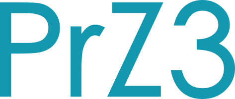

# PrZ3

  

  <a href="https://msrbot.io"><strong>MSRBot.io</strong></a> •
  <a href="https://github.com/apps/prz3-unit"><strong>PrZ3 Unit</strong></a> •
  <a href="https://github.com/PrZ3r/MSRBot.io"><strong>MSRBot.io Source</strong></a>

**PrZ3** is an open-source ecosystem dedicated to preserving, automating, and connecting global media technology standards.

Born from the [MSRBot.io](https://msrbot.io) initiative, PrZ3 builds and maintains a distributed registry of structured metadata across standards bodies, publishers, and archives — providing automation tools, schema validators, and reference indexes for the broader media technology community.

---

### What We Build

- **[MSRBot.io](https://msrbot.io/)** - a live, automated (and hand curated) Media Standards Registry (MSR) of media technology documents — extracting, validating, and linking documents across [SMPTE](https://www.smpte.org/), [ISO](https://www.iso.org/home.html), [ITU](https://www.itu.int/), [AES](https://aes2.org/) and other many other publishers, SDOs, and industry groups. 

- **[PrZ3](https://github.com/apps/prz3-unit) Framework** — Provenance and Automation Layer  
  Tooling and schema libraries for document lineage, dependency tracking, and cross-reference normalization.

- **Registry Infrastructure**  
  Scripts, validators, and automation workflows that maintain the long-term integrity of public metadata.

---

### The Resident Custodian — *PrZ3 Unit*

> *Designation:* `MSRBot-PrZ3 Unit`  
> *Role:* Metadata Integrity and Registry Guardian  
> *Prime Directive:* Penguin Parsing Protocol v3-Gen

[PrZ3 Unit](https://github.com/apps/prz3-unit) is the autonomous caretaker behind MSRBot.io — running continuous extraction, validation, and normalization cycles across the registry.  
It enforces order, cross-checks references, and maintains historical lineage for all tracked documents.

---

### Vision

To build a sustainable, interoperable metadata infrastructure for the moving-image and media technology domain — one that bridges legacy standards with modern, machine-readable ecosystems.

---

### Principles

- **Accessibility** — Everything is open, traceable, and reproducible.  
- **Interoperability** — Data should move between systems, not get trapped in them.  
- **Longevity** — Standards outlive platforms; so should their metadata.  
- **Automation with intent** — Every process exists to improve human trust in structured data.

---

### Tech Highlights

- Node.js + GitHub Actions automation pipelines  
- JSON schema normalization and provenance tracking  
- Distributed validation workflows (MSI, MRI, Extract, Validate, Sweep)  
- Continuous audit of URLs, cross-refs, and document lifecycles  
- All commits, PRs, and automated processes authored by [PrZ3 Unit](https://github.com/apps/prz3-unit)

---

### Projects

| Repository | Description |
|-------------|-------------|
| [**MSRBot.io**](https://github.com/PrZ3r/MSRBot.io) | The core Media Standards Registry — live data and automated extraction. |

---

### Branding

Official PrZ3 / MSRBot visual assets:

- [PrZ3 Logo](../branding/logos/PrZ3-Logo-blue.svg)
- [MSRBot.io Logo](../branding/logos/MSRBot-Logo-blue.svg)
- [PrZ3 Unit Icon](../branding/icons/MSRBot-PrZ3-blue.svg)

Canonical typography and mascot guidance:

- [`/branding/typography.md`](../branding/typography.md)
- [`/branding/brandmarks.md`](../branding/brandmarks.md)

These assets are the authoritative versions used across repositories, automation, and documentation.

---

### Contact

For collaboration, data contributions, or industry integration discussions:  
**Steve LLamb** — [GitHub](https://github.com/SteveLLamb) · [LinkedIn](https://www.linkedin.com/in/lluxoperon/)  
**PrZ3** — [GitHub](https://github.com/PrZ3r) · [LinkedIn](https://www.linkedin.com/company/prz3/)

---

> *“Normalize chaos. Chaos is everywhere.” — PrZ3 Unit, v3-Gen*

---

Copyright © 2026 PrZ3 LLC (d/b/a PrZ3). All rights reserved.
